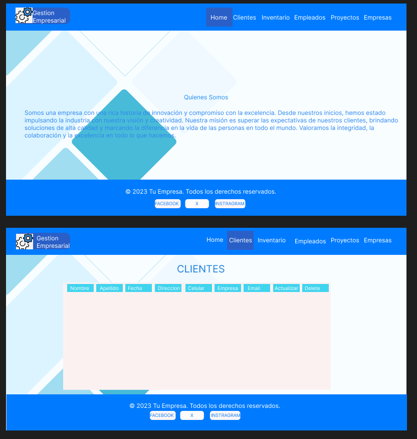
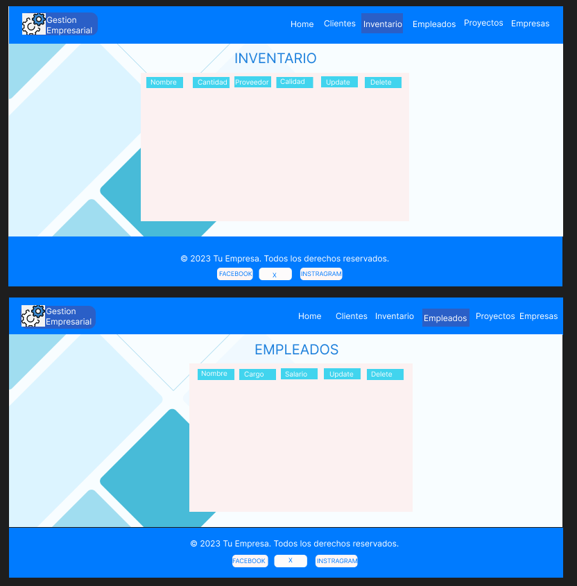
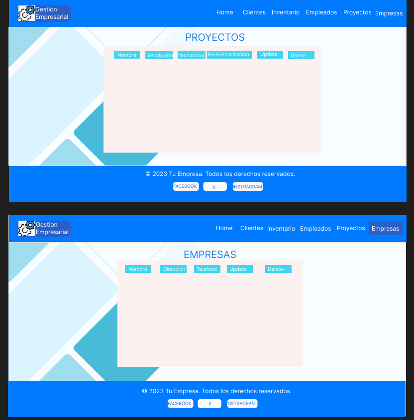
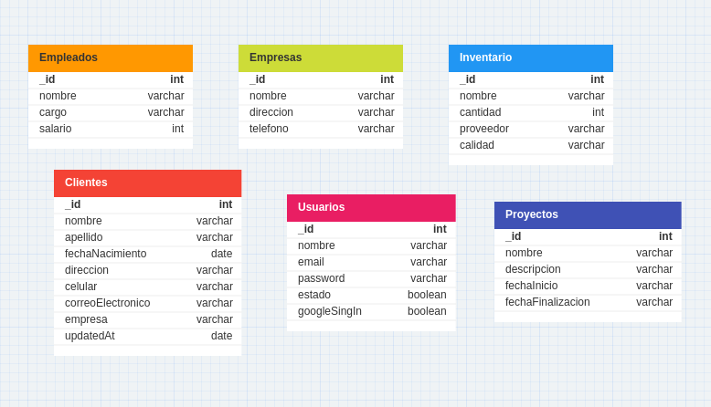

# PRE_FILTRO

## Autor: **Jairo Alonso Cardenas Blanco** 

## Link del figma de el proyecto, del diagrama de la base de datos


# PLANTEAMIENTO DEL PROYECTO

## Gestion Empresarial API

### Descripcion General
La API de Gestión Empresarial se ha desarrollado para facilitar la gestión eficiente de datos relacionados con empresas, clientes, usuarios y más. Utiliza tecnologías modernas como Node.js, Express.js para el backend y React para el frontend, ofreciendo una solución completa para la gestión de datos empresariales.

### Funcionalidad Principal

* GET: Permite obtener información detallada sobre empresas, clientes, usuarios y otros datos relacionados.
* POST: Agrega nuevos registros a la base de datos, lo que facilita la creación de registros para nuevas empresas, clientes o usuarios.
* DELETE: Elimina registros existentes cuando ya no son necesarios en la base de datos.
* PUT: Actualiza información existente, lo que permite la modificación de datos de manera eficiente.

### Tecnologias Usadas

#### BackEnd
- Node.js
- Express.js
- MongoDB

#### FrontEnd

- React

### Endpoints API

- '/api/Clientes' : EndPoint para gestionar Clientes
- '/api/Inventario' : EndPoint para gestionar Inventario
- '/api/Empleados' : EndPoint para gestionar Empleados
- '/api/Proyectos' : EndPoint para gestionar Proyectos
- '/api/Empresas' : EndPoint para gestionar Empresas

## Ejemplos de Uso

A continuación se muestran ejemplos de solicitudes HTTP utilizando CURL:

```javaScript
-
curl -X GET http://localhost:8001/api/Clientes

```

## Frontend con React:

El frontend desarrollado en React interactúa con la API para mostrar los datos almacenados. Utiliza solicitudes HTTP para obtener información y la presenta visualmente en una tabla dinámica

## Interfaz de Usuario:

El frontend cuenta con una interfaz de usuario amigable que permite a los usuarios ver, agregar, editar y eliminar registros de manera intuitiva.

# Figma

* https://www.figma.com/file/g14n0fvYIcniTtktPG3KeN/GestionEmpresarial?type=design&node-id=0-1&mode=design&t=XCrAEj6wlaOIzji6-0

Figma Imagen






#### DIAGRAMA DE LA DATABASE

Diagrama De Base De Datos No Relaciones



#### SWAGGER

1. Primero se tiene que instalar el node_modules

```bash
npm i
```

2. Segundo se tiene que ejecutar la api

```bash
npm run dev
```
Lo va a llevar a esta pagina 👇👇

```bash
http://localhost:8001/api-docs/#/
```

